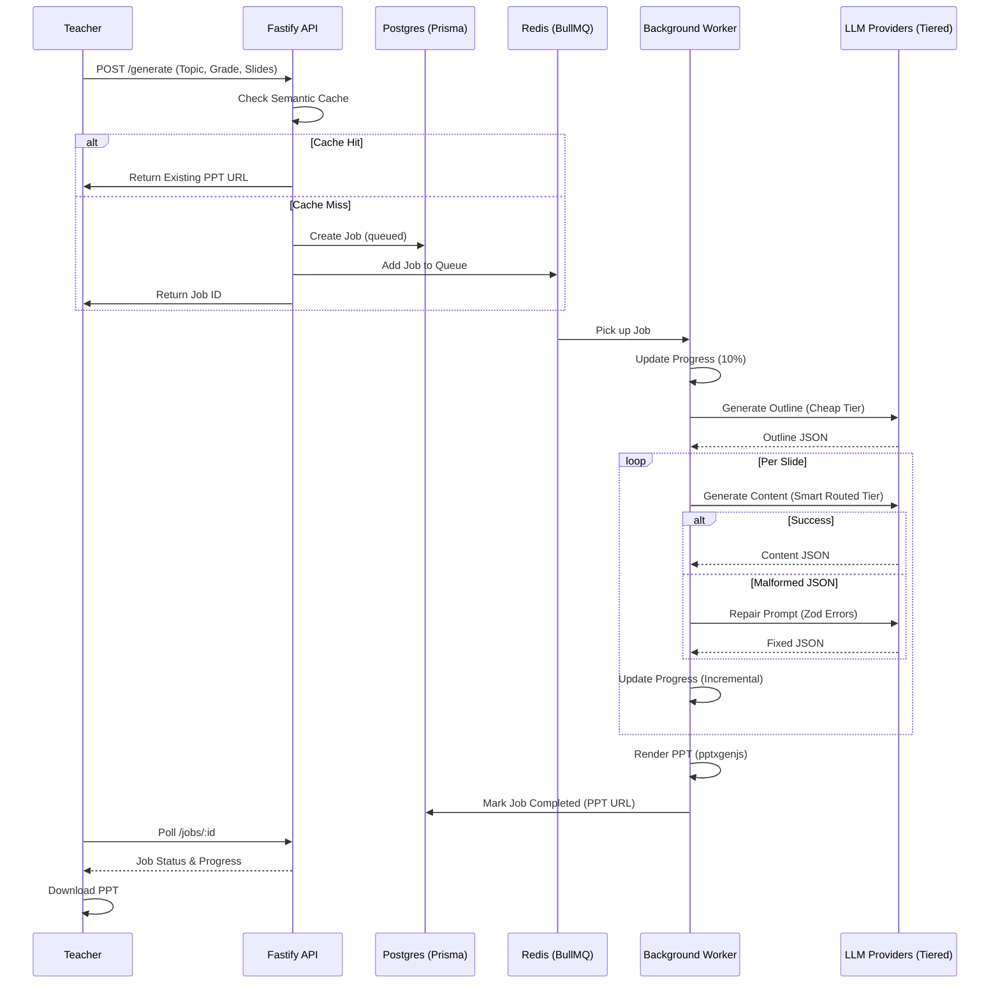

# Savra Technical Architecture

## High-Level Overview
Savra is built as a highly resilient, cost-optimized, asynchronous AI presentation engine. The system decouples request handling from heavy AI generation to ensure a smooth user experience.

## System Workflow (Sequence Diagram)

## Core Components

### 1. The Orchestration Layer (Fastify + BullMQ)
*   **Decoupled Processing**: High-latency LLM calls are moved to a worker pool to prevent API timeouts.
*   **Real-time Feedback**: Incremental progress reporting (10% -> 25% -> ... -> 100%) gives teachers visual feedback.

### 2. The AI Generation Pipeline
*   **Two-Step Approach**: Outline generation precedes content generation to ensure structural integrity.
*   **Validation & Repair**: Every AI response is validated via Zod. If it fails, a targeted repair prompt is sent instead of a blind retry.

### 3. Tiered Model Strategy
*   **Cheap Tier**: Handles high-volume, low-complexity tasks such as outlines, summaries, quizzes, activities, and JSON repair.
*   **Premium Tier**: Handles low-volume, high-complexity academic content such as concepts, formulas, and detailed examples.
*   **Provider Routing**: Provider choices are environment-driven and can route through OpenAI, Gemini-compatible, or OpenRouter-compatible clients.

### 4. Semantic Cache (Semantic Search)
*   Uses vector embeddings (via `local` or `openai` provider) to find similar historical requests.
*   Drastically reduces costs and generation time for common educational topics.

## Tech Stack
*   **Frontend**: Next.js 16, React 19, Tailwind CSS, Lucide Icons.
*   **Backend**: Node.js (ESM), Fastify, Prisma (PostgreSQL).
*   **Queue**: BullMQ, Redis.
*   **Rendering**: pptxgenjs.
*   **AI**: OpenAI SDK with OpenAI, Gemini-compatible, and OpenRouter-compatible routing.
