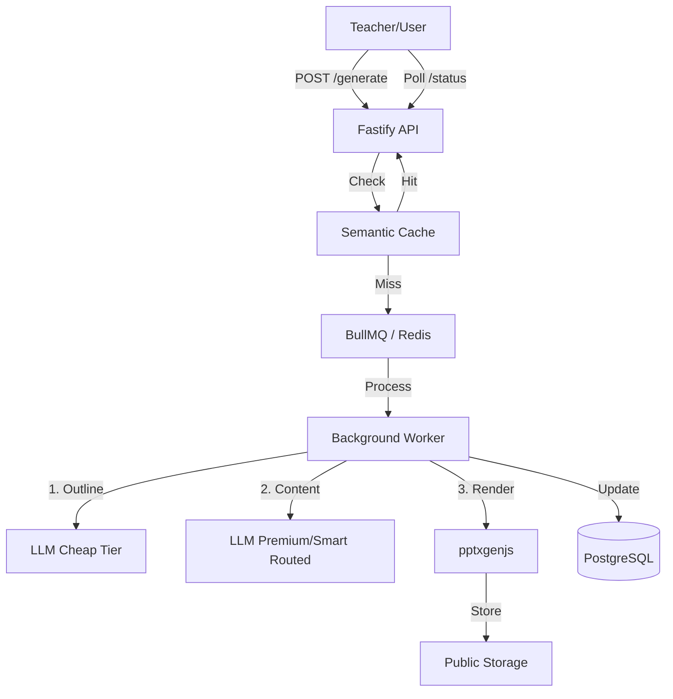

# Savra PPT Generation Architecture Design

## 01 | System Design

Savra implements a resilient, asynchronous, and cost-optimized pipeline for AI-driven presentation generation. The core philosophy is to decouple high-latency LLM operations from the user interface while maintaining structural integrity and high quality.

### Architecture Overview
The system uses a producer-consumer pattern backed by **BullMQ (Redis)** to handle background processing.

### Flow of Requests
1. **Deduplication & Caching**: Every request is hashed. If an identical request exists in the `Job` table or a semantically similar one exists in the `PresentationCache`, the system returns the existing PPT immediately.
2. **Asynchronous Handshake**: If no cache hit, a job is created and queued. The user receives a `202 Accepted` with a `jobId`.
3. **Structured Generation**:
   - **Step A**: Generate a structural outline (JSON) using a cheaper model.
   - **Step B**: Generate detailed slide content for each section using a smart-routed model.
   - **Step C**: Validate every response via **Zod**. If validation fails, a targeted repair prompt is sent.
4. **Rendering**: The structured JSON is injected into pre-built code-defined templates to ensure visual consistency and accessibility.

---

## 02 | Cost Reduction Strategy

Currently, Savra pays ₹15 per PPT. At 10,000 users, this is unsustainable. Our goal is to reduce this by 60-80% through:

| Lever | Implementation | Impact |
| :--- | :--- | :--- |
| **Semantic Caching** | Returns existing PPTs for similar topics (e.g., "Photosynthesis Grade 8"). | ~30% Cost Saving |
| **Tiered Model Routing** | Uses Gemini Flash or GPT-4o-mini for outlines and JSON repair; reserved Premium models only for complex concepts. | ~40% Cost Saving |
| **Prompt Optimization** | Using system instructions and compact JSON schemas to reduce input/output token counts. | ~10% Cost Saving |
| **Template-First** | Zero AI cost for layout design; the LLM only generates text/data. | High Reliability |

**Projected Cost Math:**
- Current: ₹15/PPT
- New: ~₹3-5/PPT (Mixed tier + Cache hits)
- Monthly for 10K users (assuming 2 PPTs/week per teacher, 50% teachers):
  - Current: 5,000 * 8 * 15 = ₹6,00,000
  - New: 5,000 * 8 * 4 = ₹1,60,000
  - **Total Savings: ₹4,40,000/month**

---

## 03 | Reliability Plan

The primary failure point is LLM 503 errors and malformed JSON.

### Handling LLM Outages
- **Circuit Breaker**: If a provider (e.g., Gemini) fails N times, the system automatically routes all traffic to a secondary provider (e.g., OpenAI/OpenRouter) for a cooldown period.
- **Smart Fallback**: Not just "use cheaper," but "use available." The system tries the primary tier, then a secondary tier, then a fallback static template if all else fails.

### Handling Malformed JSON
- **JSON Repair Logic**: Uses a specific prompt containing the original output + Zod error messages + Schema definition to ask the LLM to fix the structure.
- **Durable Retries**: BullMQ handles worker crashes or network timeouts with exponential backoff.

---

## 04 | Scaling Plan

### Current (2,400 Users) vs Target (10,000 Users)
- **Bottlenecks**: Synchronous LLM calls and DB connections.
- **Solution**: 
  - **Horizontal Scaling**: API and Workers are stateless. We can spin up more worker containers to handle job bursts.
  - **Database**: PostgreSQL indexes on `hash`, `status`, and `userId` ensure fast lookups even with millions of rows.
  - **Queue Concurrency**: BullMQ allows us to limit the number of concurrent LLM calls per worker to avoid hitting provider rate limits.

### Infrastructure Roadmap
- **Now**: Docker Compose / Single Node (Railway/Render).
- **Later**: Kubernetes (HPA) to scale workers based on queue depth (`bullmq_jobs_waiting`).
- **Storage**: Move from local `public/files` to S3-compatible storage with CloudFront CDN for global delivery.
